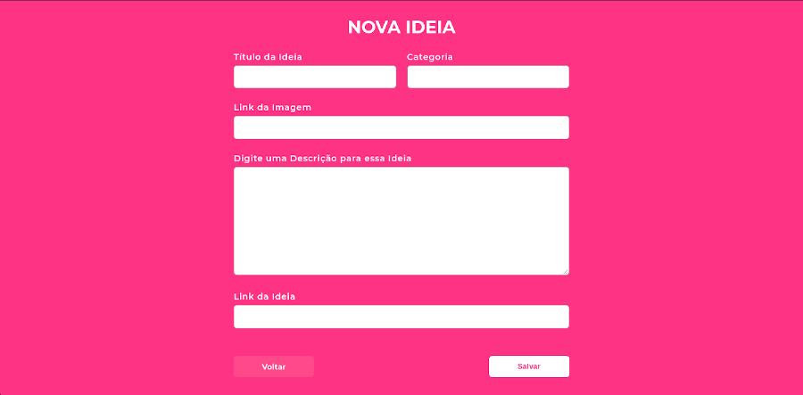

<div align="center" style="margin: 50px;">
  
</div>

<div align="center">
  <h1> Next Level Week 01 - Ecoleta - 01/06/2020 - 05/06/2020 </h1>
</div>

<div align="center" style="margin: 20px;">
  <p align="center" >
    <a href="#-descricao-da-aplicação"> 🎯 Descrição da Aplicação </a> |
    <a href="#-tecnologias-utilizadas"> 🚀 Tecnologias Utilizadas </a> |
    <a href="#-tecnologias-usadas"> 👨‍🚀 Dependências Utilizadas </a> |
  </p>
</div>

<div align="center" style="margin: 20px;">
  <p align="center" >
    <a href="#-prévia-da-aplicação"> 🔥 Prévia da Aplicação </a> |    
    <a href="#-deploy-da-aplicação"> 🔨 Deploy da Aplicação </a> |
    <a href="#-executando-o-projeto"> ⚡ Executando o Projeto </a> |
    <a href="#-como-contribuir?"> 🤔 Como Contribuir? </a> |    
  </p>
</div>

## 🎯 Descrição da Aplicação

<p> Aplicativo para armazenar informações de estabelecimentos que coletam items de resíduos para reciclagem. O estabelecimento pode armazenar as informações como nome da loja, whatsapp, e-mail e endereço da loja, além de informar os itens que são coletados. O usuário pode buscar os estabelecimentos que possuem coleta do item desejado no endereço desejado, além de poder entrar em contato via whatsapp e e-mail com estabelecimento. </p> 

<p> O aplicativo foi organizado onde o estabelecimento utiliza a web para armazenar suas informações e o usuário utiliza o aplicativo mobile para procurar os estabelecimentos. </p> 

<p> A aplicação foi criada através do curso realizado pela 
  
  <a href="https://rocketseat.com.br/"> Rocketseat </a>
  (Next Level Week - 01), onde esse curso foi realizado no dia <strong> 01/06/2020 </strong> até o dia <strong> 05/06/2020 </strong>. 
</p> 

## 🚀 Tecnologias Utilizadas

<p>
  <strong> Back-end </strong>: Node.JS com TypeScript
</P>
<p>
  <strong> Front-end Web</strong>: React com TypeScript
</P>
<p>
  <strong> Front-end Mobile</strong>: React Native com TypeScript
</P>
<p>
  <strong> Banco de dados </strong>: SQLite
</P>

## 👨‍🚀 Dependências Utilizadas

  <p> <strong> Back-end </strong>: celebrate, cors, express, knex, multer, sqlite3. </p>
  <p> <strong> Front-end Web </strong>: axios, react-leaflet, react-dropzone, react-icons, react-router-dom. </p>
  <p> <strong> Front-end Mobile </strong>: expo-font, expo-location, , expo-mail-composer, expo-google-fonts, react-navigation, axios, constants, logkitty, react-native-gesture-handler, react-native-maps, react-native-reanimated, react-native-safe-area-context", react-native-screens, react-native-svg. </p>
  
## 🔥 Prévia da Aplicação

<div align="center" style="margin: 50px;">
  <div style="margin: 50px;">
    
    
  </div>
  <div style="margin: 50px;">
    
    
    
  </div>
</div>

## 🔨 Deploy da Aplicação

<p> <strong> Em Construção </strong> </p>

## ⚡ Executando o Projeto

#### Clonando o projeto

```sh
$ git clone https://github.com/EikESousA/RS-Ecoleta.git
$ cd RS-Ecoleta
```

#### Iniciando a API

```sh
$ cd server
$ yarn && yarn dev
```

#### Iniciando o Front-end Web
```sh
$ cd web
$ yarn && yarn start
```

#### Iniciando o Front-end Mobile (Android)

```sh
$ cd mobile
$ yarn && yarn android && yarn start
```

## 🤔 Como Contribuir?

```bash
# Clone o seu fork
$ git clone url-do-seu-fork && cd RS-Ecoleta

# Crie uma branch com sua feature ou correção de bugs
$ git checkout -b minha-branch

# Faça o commit das suas alterações
$ git commit -m 'feature/bugfix: minhas alterações'

# Faça o push para a sua branch
$ git push origin minha-branch
```
