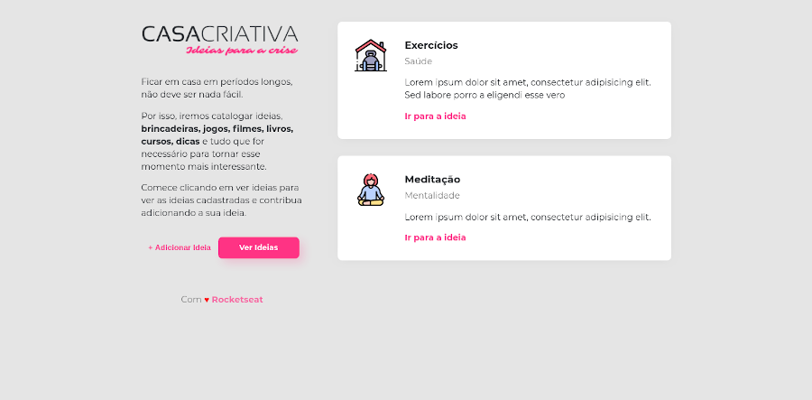
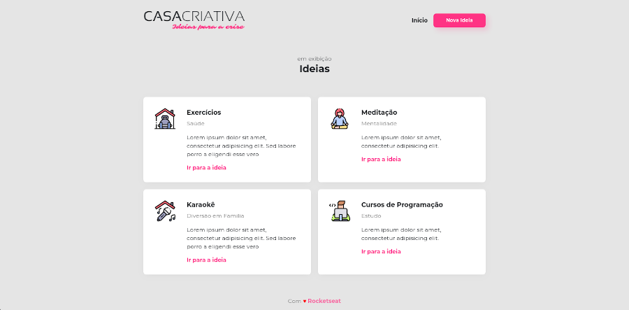

<div align="center" style="margin: 50px;">
  
</div>

<div align="center">
  <h1> WorkShop Dev Especial - Casa Criativa - 22/03/2020 - 26/03/2020 </h1>
</div>

<div align="center" style="margin: 20px;">
  <p align="center" >
    <a href="#-descricao-da-aplicação"> 🎯 Descrição da Aplicação </a> |
    <a href="#-tecnologias-utilizadas"> 🚀 Tecnologias Utilizadas </a> |
    <a href="#-tecnologias-usadas"> 👨‍🚀 Dependências Utilizadas </a> |
  </p>
</div>

<div align="center" style="margin: 20px;">
  <p align="center" >
    <a href="#-prévia-da-aplicação"> 🔥 Prévia da Aplicação </a> |    
    <a href="#-deploy-da-aplicação"> 🔨 Deploy da Aplicação </a> |
    <a href="#-executando-o-projeto"> ⚡ Executando o Projeto </a> |
    <a href="#-como-contribuir?"> 🤔 Como Contribuir? </a>   
  </p>
</div>

## 🎯 Descrição da Aplicação

<p> Aplicação web para armazenar idéias durante o COVID-19. </p> 

<p> A aplicação foi criada através do curso realizado pela 
  
  <a href="https://rocketseat.com.br/"> Rocketseat </a>
  (WorkShop Dev Especial), onde esse curso foi realizado no dia <strong> 22/03/2020 </strong> até o dia <strong> 26/03/2020 </strong>. 
</p> 

## 🚀 Tecnologias Utilizadas

<p>
  JavaScript
</P>
<p>
  HTML
</P>
<p>
  CSS
</P>
<p>
  <strong> Banco de dados </strong>: PostgreSQL
</P>

## 👨‍🚀 Dependências Utilizadas

  <p> express, nodemon, mongoose, nunjucks, pg </p>
  
## 🔥 Prévia da Aplicação

<div align="center" style="margin: 50px;">
  <div style="margin: 50px;">
    
    
    
  </div>
</div>

## 🔨 Deploy da Aplicação

<p> <strong> Em Construção </strong> </p>

## ⚡ Executando o Projeto

#### Clonando o projeto

```sh
$ git clone https://github.com/EikESousA/RS-CasaCriativa.git
$ cd RS-CasaCriativa
```

#### Iniciando a API

```sh
$ yarn && yarn start
```

Abra o browser e acesse o dominio:

```sh
localhost:3000
```

## 🤔 Como Contribuir?

```bash
# Clone o seu fork
$ git clone url-do-seu-fork && cd RS-CasaCriativa

# Crie uma branch com sua feature ou correção de bugs
$ git checkout -b minha-branch

# Faça o commit das suas alterações
$ git commit -m 'feature/bugfix: minhas alterações'

# Faça o push para a sua branch
$ git push origin minha-branch
```

## 📝 Licença

Esse projeto está sob a licença MIT. Veja o arquivo [LICENSE](LICENSE.md) para mais detalhes.
